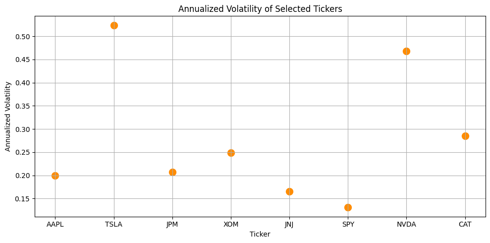
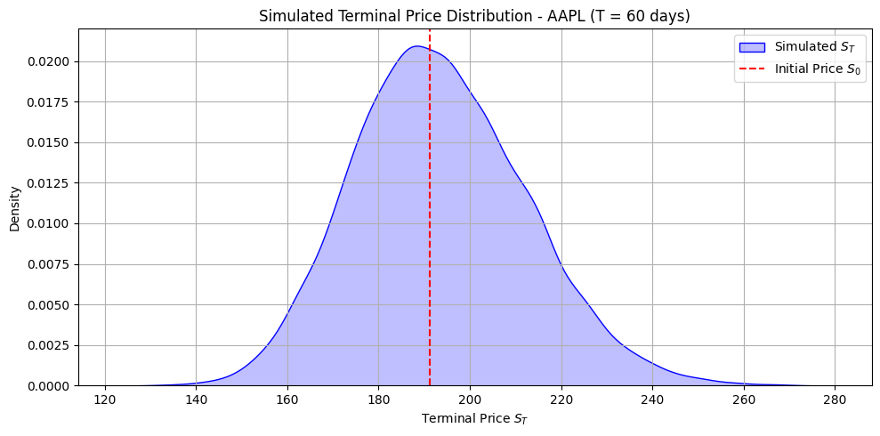
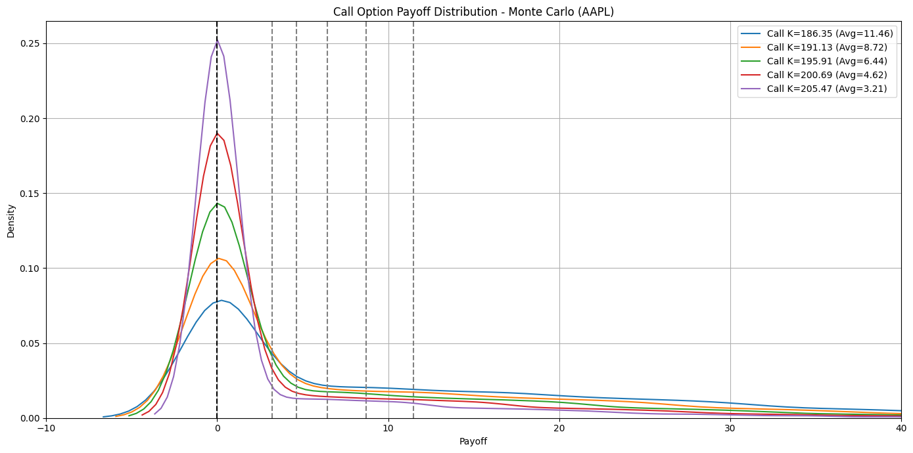
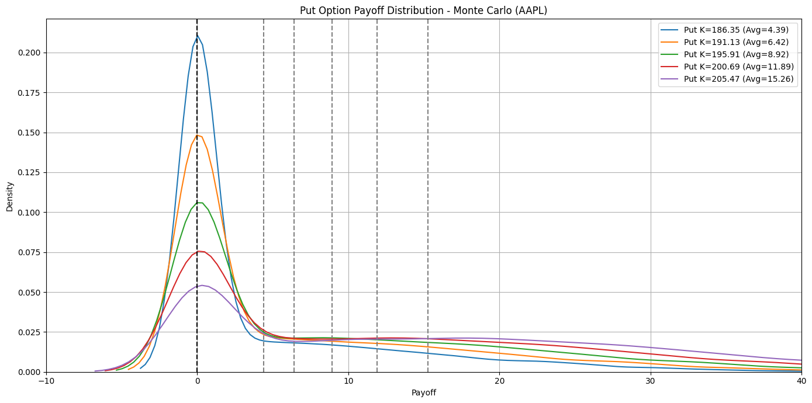
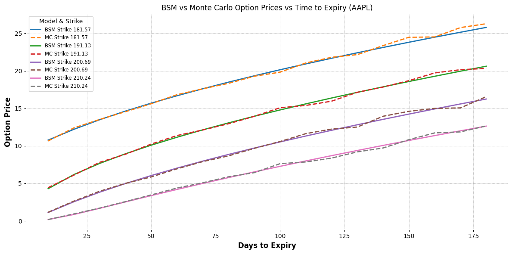
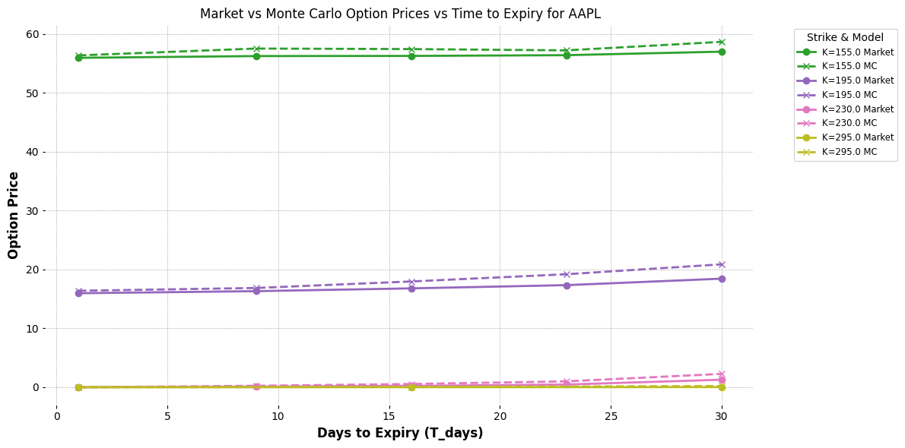

# Monte Carlo vs Black-Scholes Option Pricing: A Comparative Study with Real Market Data

## Project Summary

This project is acomparison between **Monte Carlo simulation** and the **Black-Scholes-Merton (BSM)** model for option pricing. We benchmark both models against **real market option prices** using data from Yahoo Finance via `yfinance`. The focus is on evaluating model performance across various tickers, strike prices, and expirations.

---

## 📈 Objectives

* Estimate call option prices using **Monte Carlo simulation**
* Calculate theoretical prices using the **Black-Scholes-Merton formula**
* Compare both model outputs against **real mid prices** of options from the market
* Provide **visualizations** for insights


---

##  Summary

### 1. Data Collection

* Downloaded **historical stock prices** for tickers from Yahoo Finance (AAPL, TSLA, JPM, XOM, JNJ, SPY, NVDA, CAT)
* Extracted **real call option chains** for each ticker for 5 expiration dates

### 2. Volatility Estimation

* Calculated **log returns** from historical prices
* Estimated **annualized volatility** per ticker using 1-year daily data

### 3. Black-Scholes Model

* Implemented BSM pricing for European call options
* Generated BSM price curves vs. expiry and strike prices

### 4. Monte Carlo Simulation

* Implemented MC pricing using Brownian motion
* Simulated terminal prices and estimated expected discounted payoff
* Generated MC price curves vs. expiry and strike prices

### 5. Real Market Comparison

* Extracted **mid prices** = (bid + ask)/2 for each real option
* Matched tickers, strike, and expiry for valid comparison
* Calculated **MC price per row** of the real dataset

### 6. Evaluation

* Compared **real vs MC vs BSM** for each option
* Plotted **price curves** with different styles to distinguish MC and BSM
* Plotted **diagnostic scatter plots** for error analysis

### 7. Observations & Insights

* BSM and MC models aligned well for near-the-money, liquid options
* Large deviations for deep ITM/OTM or illiquid options
* **Implied volatility** gave more realistic inputs than historical volatility
---

## 🧮 Monte Carlo Simulation Details & Visualizations

### Step-by-Step Monte Carlo Option Pricing:

1. **Annualized Volatility of Selected Tickers**

   * Calculated from historical daily log returns.
   * Annualized using the formula: $\sigma_{annual} = \sigma_{daily} \times \sqrt{252}$
   * 


2. **Simulating Terminal Stock Prices**

   * Formula:
     $S_T = S_0 \cdot \exp\left((r - 0.5 \cdot \sigma^2) \cdot T + \sigma \cdot \sqrt{T} \cdot Z\right)$
   * Where $Z \sim N(0, 1)$
   * Represents future stock price distribution after time T under risk-neutral assumptions
   * 

3. **Call Option Payoff Distribution**

   * Payoff for each strike: $\max(S_T - K, 0)$
   * Expected payoff discounted at risk-free rate gives the option price:
     $C = e^{-rT} \cdot \mathbb{E}[\max(S_T - K, 0)]$

     

4. **Put Option Payoff Distribution**

   * Payoff: $\max(K - S_T, 0)$
   * Similar logic for computing expected payoff and discounting
   * 

5. **Comparison Across Timeframes & Strikes**

   * Comparared MC with bsm prices for strike prices (e.g., 2.5%, 5%, 7.5% deviations from spot) across timeframes
   * Aggregated into dataframes per ticker
   * Used line plots to visualize how MC prices evolve with time to expiry
   * 
     
6. **Error Metrics and Visulization**

   * CompareMC prices and real prices for strike prices (e.g., 2.5%, 5%, 7.5% deviations from spot) across timeframes
   

---

## 🧮 Methods

### Monte Carlo Formula:

```
S_T = S_0 * exp((r - 0.5 * sigma^2) * T + sigma * sqrt(T) * Z)
Price = exp(-r * T) * E[max(S_T - K, 0)]
```

### Black-Scholes Formula:

```
Call = S * N(d1) - K * exp(-rT) * N(d2)
d1 = [ln(S/K) + (r + 0.5 * sigma^2) * T] / (sigma * sqrt(T))
d2 = d1 - sigma * sqrt(T)
```


---

## 📊 Results

The following table summarizes the error metrics comparing the Monte Carlo estimated option prices against real mid-market prices for each ticker:

| Ticker | MAE    | MSE      | RMSE    | R² Score |
|--------|--------|----------|---------|----------|
| AAPL   | 0.6333 | 0.8528   | 0.9235  | 0.9991   |
| CAT    | 5.8439 | 421.1553 | 20.5221 | 0.8018   |
| JNJ    | 0.7212 | 0.9277   | 0.9631  | 0.9971   |
| JPM    | 3.5774 | 295.8107 | 17.1991 | 0.8064   |
| NVDA   | 0.7259 | 1.2136   | 1.1016  | 0.9991   |
| SPY    | 0.5371 | 0.7170   | 0.8467  | 0.9996   |
| TSLA   | 1.2035 | 3.4307   | 1.8522  | 0.9992   |
| XOM    | 0.6078 | 0.8957   | 0.9464  | 0.9923   |

---


